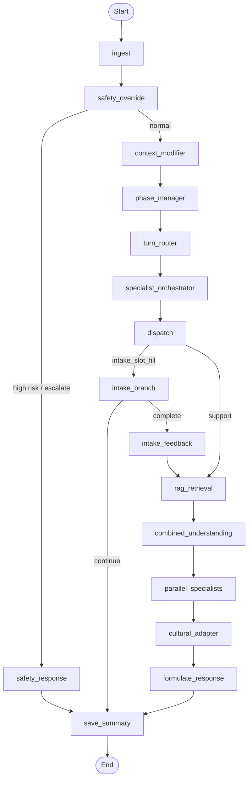

# Pipeline Workflow — Adaptive 5-Phase Couples Therapy

## Therapy Phases

The counseling assistant follows a structured 5-phase couples therapy program.
Phases guide behavior but do not imprison it — the system supports non-linear
movement including temporary fallback, regression, and phase review.

| Phase | Arabic | English | Key Tools |
|-------|--------|---------|-----------|
| 1 | التقييم وبناء العلاقة العلاجية | Assessment & Building Therapeutic Relationship | Counseling interview, marital satisfaction assessment, interaction observation |
| 2 | فهم الذات والطرف الآخر | Understanding Self & Partner | Self-awareness exercises, needs mapping, homework |
| 3 | مهارات التواصل وإدارة الخلاف | Communication Skills & Conflict Management | Role playing, reframing, practical training |
| 4 | بناء الثقة والقرب العاطفي | Building Trust & Emotional Closeness | Appreciation letters, couple time, positive rituals |
| 5 | التثبيت والوقاية | Stabilization & Prevention | Progress review, conflict prevention plan, relapse prevention |

## Therapy Approaches

| Approach | Arabic | Description |
|----------|--------|-------------|
| Integrative Marriage Counseling | الإرشاد الزواجي التكاملي | Combines multiple therapeutic modalities |
| CBT for Couples | العلاج المعرفي السلوكي الزواجي | Changing negative thought patterns and behaviors |
| Emotion-Focused Therapy (EFT) | العلاج القائم على المشاعر | Emotional bonds and attachment needs |
| Value-Based Counseling | الإرشاد القيمي | Aligns therapy with shared values and beliefs |

## Expected Outcomes

- Noticeable improvement in communication
- Reduced conflict intensity
- Clearer roles and expectations
- Greater sense of safety and support
- Increased marital satisfaction and stability

## Pipeline Flow

## Adaptive Routing Architecture

The system processes each turn through six layers of control:

1. **Safety Override** — first-pass risk, appropriateness, and abuse screening
2. **Context Modifier** — classify session framing (ordinary conflict, trust breach, possible abuse, separation, etc.)
3. **Phase Manager** — determine dominant phase using weighted milestone + readiness evidence
4. **Turn Router** — select what this specific turn needs (containment, coaching, psychoeducation, etc.)
5. **Specialist Orchestrator** — decide which specialists to invoke based on phase policy, turn mode, safety, and coaching readiness
6. **Final Composer** — produce one coherent response with phase-consistent tone and safe blending

### Phase Policies

Each phase defines preferred, allowed-but-limited, and blocked response modes:

- **Phase 1:** preferred empathy/clarification/intake; limited psychoeducation; blocked coaching/trust-repair/maintenance
- **Phase 2:** preferred psychoeducation/empathy; limited coaching; blocked trust-repair/maintenance
- **Phase 3:** preferred coaching/psychoeducation; limited trust-repair; blocked maintenance
- **Phase 4:** preferred trust-repair/closeness/coaching; all allowed
- **Phase 5:** preferred maintenance/progress/coaching; all allowed

### Phase Transition Types

- **stay** — continue in current phase
- **advance** — move to next phase (requires readiness >= 0.50 AND min_turns met)
- **temporary_fallback** — temporarily use early-phase containment behavior without resetting phase
- **regress** — move to an earlier phase (requires strong evidence)
- **review_needed** — hard cap reached without readiness; triggers review, NOT forced advancement

### Coaching Readiness

Coaching is gated by both phase policy AND current emotional state:
- Blocked when emotional intensity >= 0.7 (user is too dysregulated)
- Blocked in abuse/coercive contexts
- Blocked when insufficient context (slots < 20%)
- Allowed in early phases when context and safety support it

### Context Modifiers

Session framing that influences routing policy:
- `ordinary_conflict` — standard couples strain
- `repair_after_breach` — betrayal/trust breach detected
- `high_escalation` — explosive conflict language
- `possible_abuse` — coercive control or abuse indicators
- `separation_or_breakup` — relationship ending language
- `one_partner_unavailable` — solo participation

---

## Phase Details

### Phase 1: Assessment & Building Therapeutic Relationship

**Objectives:**
- Getting to know the couple and building safety
- Assessing the nature of the problem and relationship history
- Setting each partner's expectations
- Establishing shared therapy goals

**Milestones:** safety_established, problem_assessed, expectations_set, goals_defined

### Phase 2: Understanding Self & Partner

**Objectives:**
- Exploring personality patterns and their effect on marriage
- Understanding cognitive and communicative differences
- Discovering unmet emotional needs

**Milestones:** personality_explored, differences_discussed, unmet_needs_identified

### Phase 3: Communication Skills & Conflict Management

**Objectives:**
- Developing active listening skills
- Expressing feelings without blame
- Managing anger constructively
- Joint problem solving and decision making

**Milestones:** active_listening_practiced, nonblame_expression_learned, anger_management_discussed, problem_solving_practiced

### Phase 4: Building Trust & Emotional Closeness

**Objectives:**
- Understanding causes of trust erosion
- Learning proper apology and forgiveness
- Enhancing appreciation and caring
- Reviving the emotional connection

**Milestones:** trust_erosion_understood, apology_forgiveness_practiced, appreciation_enhanced, emotional_connection_revived

### Phase 5: Stabilization & Prevention

**Objectives:**
- Reviewing what has been learned
- Creating a plan for future conflicts
- Strengthening independence while maintaining connection
- Final progress assessment

**Milestones:** learning_reviewed, future_plan_created, independence_with_connection, final_assessment_done

---

## Node summary

| Node | Role |
|------|------|
| **ingest** | Load turn text, audio path, conversation history |
| **safety_override** | First-pass risk, abuse, coercive control, and appropriateness screening |
| **safety_response** | High-risk reply with crisis resources and escalation guidance |
| **context_modifier** | Classify session framing (ordinary conflict, trust breach, abuse, etc.) |
| **phase_manager** | Track therapy phase (1-5), evaluate milestones + soft signals, manage adaptive transitions |
| **turn_router** | Select turn_mode per message (containment, coaching, psychoeducation, etc.) independent of phase |
| **specialist_orchestrator** | Set run_* flags using phase policy + turn_mode + safety + coaching readiness |
| **dispatch** | Conditional edges route to intake or support chain |
| **intake_branch** | Context-aware smart intake: slot extraction, greeting, transition signaling |
| **rag_retrieval** | RAG retrieval for contextual knowledge using Qdrant when configured, otherwise local FAISS |
| **combined_understanding** | One LLM call: emotion, sentiment, problem_category |
| **parallel_specialists** | Emotion, coach, growth, psychoeducation, pattern agents in parallel |
| **cultural_adapter** | Cultural adaptation of content |
| **formulate_response** | Build final_response with turn-mode-appropriate tone, safety constraints, and phase context |
| **save_summary** | Save conversation summary + decision metadata + therapy phase state to SQLite |

## Routing

- **safety_override:** `risk_level == "high"` or `risk_action == "escalate_to_human"` -> `safety_response`; else -> `context_modifier`.
- **dispatch:** By `turn_mode` -> `intake_branch` (intake_slot_fill) | support chain (all other modes).
- **phase_manager:** Evaluates milestones + soft signals + turn count; advances only with readiness evidence.

## RAG Backend

`rag_retrieval` can use Qdrant for semantic knowledge retrieval when `QDRANT_URL`,
`QDRANT_API_KEY`, and `QDRANT_COLLECTION` are set. Query vectors are generated with
OpenAI embeddings using `EMBEDDING_MODEL` (default `text-embedding-ada-002`), so
documents must be ingested with the same model. If Qdrant is disabled,
unconfigured, or unavailable, the node falls back to the local FAISS demo index.
Use `scripts/ingest_qdrant.py` to seed or update the collection.

---

## State shape (AppState)

Main parts:
- **turn:** text, audio_path, turn_mode, turn_mode_reason, safety_override_triggered, safety_flags, turn_type, user_intent, emotional_intensity, response_style, risk_level, risk_type, risk_action, run_* flags, agent outputs, final_response
- **case:** problem_category, plan, slots_filled, context_modifier, readiness_score, readiness_reason, coaching_eligible, coaching_eligibility_reason, soft_signals_detected, milestones_completed
- **profile:** profile_notes, culture, gender
- **meta:** turn_id, timestamp, latency_ms
- **therapy:** current_phase, phase_confidence, phase_transition_decision, phase_transition_reason, temporary_fallback, session_id, turns_in_phase, total_turns, milestones, phase_goals, therapy_approach, phase_history

## Decision Metadata (persisted per turn)

Each turn persists a `decision_metadata` JSON blob to `conversation_summary` containing:
turn_mode, turn_mode_reason, safety_override_triggered, safety_flags, context_modifier,
readiness_score, readiness_reason, coaching_eligible, coaching_eligibility_reason,
soft_signals_detected, milestones_completed, phase_transition_decision,
phase_transition_reason, phase_confidence, temporary_fallback, risk_level,
risk_type, risk_action, allowed_actions, must_ask, must_refuse.
